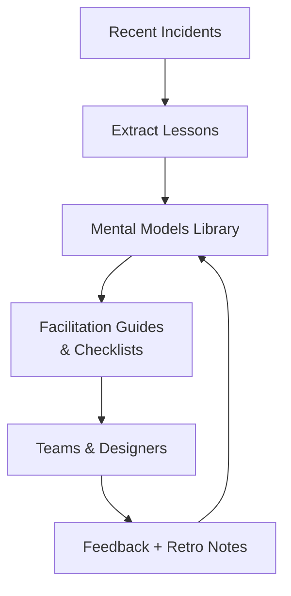

# 02. Three Mental Models & Design Intuition

## Problem Overview
- Capture reusable thinking tools that guide rapid system design decisions before deep dives.
- Package models so new engineers can diagnose trade-offs under time pressure.

## Functional Requirements
- Document three canonical models (e.g., Backpressure Triangle, CAP switches, Hot-path slicing) with triggers for use.
- Provide facilitation script for 30-minute workshops that rehearse each model using historical incidents.
- Offer checklists that attach the models to the rest of the curriculum’s problems.

## Non-Functional Goals
- Materials must be portable (Markdown/PDF) and easily embedded into retros or design docs.
- Encourage debate: each model includes prompts, anti-patterns, and metrics to monitor.

## Architecture Overview
- Knowledge base stored in Git-backed docs; surfaced via internal handbook site.
- Companion exercises stored as issue templates that students can duplicate.
- Optional automation: Slack bot that serves a random model when `/design-check` command is invoked.

## Data & Templates
- Template fields: `Scenario`, `Tension`, `Indicators`, `Interventions`, `Escalation path`.
- Backpressure model uses queue depth + latency graphs; CAP model uses matrix heatmaps; Hot-path model overlays dependency graphs.

## Implementation Plan
1. Interview senior engineers to extract tacit heuristics and map them to incidents.
2. Draft canonical doc per model following the template and review with peers.
3. Build lightweight facilitation deck + worksheets for breakout sessions.
4. Automate reminders or Slack bot integration to keep models top-of-mind.
5. Measure adoption via retro templates referencing the models.

## Testing & Validation
- Pilot sessions with small cohorts, collect feedback surveys, and iterate wording/examples.
- Track whether new design docs cite at least one model (target >70%).

## Operational Considerations
- Keep models updated after major architecture shifts or on-call learnings.
- Archive outdated heuristics and annotate when assumptions change (e.g., new datastore replaces old CAP profile).

## Tutorial Deep Dive
### Block Diagram

### Design Walkthrough
- **Incident harvesting:** Start with a shared log of outages/launches, tag each with tensions observed, and use it to populate the models repository.
- **Model codification:** For each model capture triggers, diagrams, anti-patterns, and example metrics so the artifact is actionable during interviews or reviews.
- **Workflow integration:** Embed checklists into design doc templates, retro forms, and Slack bots so referencing a model becomes muscle memory.
- **Feedback loop:** Track how often models are invoked, what gaps emerge, and iterate by adding new heuristics or pruning outdated ones.

## Interview Kit
1. **How do you keep mental models from becoming dogma?**  
   Pair each model with explicit “fails when…” guidance, encourage experiments that challenge the assumptions, and review them quarterly to incorporate new data.
2. **How would you introduce these models to a new team quickly?**  
   Run a workshop using a recent incident, walk through applying each model live, and provide cheat sheets plus async reflection prompts.
3. **Which metrics prove that models improved design quality?**  
   Track review cycle time, number of late-stage design pivots, and incident frequency tied to model-covered areas; aim for measurable reductions over multiple releases.
