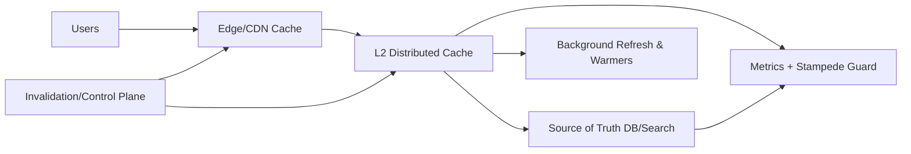

# 04. Caching and Their Issues at Scale

## Problem Overview
- Maintain high cache hit rates while defending against stampedes, stale data, and replication gaps.

## Functional Requirements
- Support multiple cache classes (hot keys, streaming sessions, immutable blobs) with tailored TTL + eviction.
- Implement cache stampede protection and write policies (write-through, refresh-ahead, write-back).
- Provide multi-tier caches (edge CDN, mid-tier Redis, client caches) with invalidation APIs.

## Non-Functional Goals
- Target >95% hit rate for hot key class, rebuild cold cache within 5 minutes after node loss.
- Consistency windows configurable per data class; guarantee no stale data beyond TTL + epsilon.

## Architecture Overview
- Frontend gateway consults local L1 cache; L2 distributed cache (Redis/Memcached/DiceDB) replicates via cluster shards.
- Metadata service tags keys with class + invalidation strategy.
- Background refresh workers pre-warm caches and coalesce identical misses.

## Data Design & APIs
- Cache metadata table: `(key_pattern, class, ttl, eviction_policy, refresh_strategy)`.
- API endpoints for `POST /invalidate`, `POST /warmup`, `GET /cache-metrics`.
- Lua or eBPF scripts for token-bucket gating and deterministic jitter on TTLs.

## Implementation Plan
1. Classify datasets and map to cache tiers + TTL/eviction choices.
2. Implement read/write path wrappers with request coalescing + jittered TTL expiration.
3. Deploy background refresh workers + warmup APIs for major releases.
4. Layer observability: per-shard hit/miss, smart sampling of stale reads, and invalidation audit logs.
5. Add chaos routines: random node eviction, mass invalidation, and verifying data-plane recovery.

## Testing & Validation
- Load-test hot keys with synthetic skew to validate randomization + fallback behavior.
- Trigger partial network partition to confirm gossip-based invalidation convergence times.
- Validate fallback to source-of-truth datastore under prolonged cache outage.

## Operational Considerations
- Maintain library for safe cache clients (rate limiting, instrumentation, fallback) to avoid misuse.
- Provide dashboards for memory usage, replication lag, and invalidation volume; set alerts for stampede indicators.

## Tutorial Deep Dive
### Block Diagram

### Design Walkthrough
- **Tiered strategy:** Decide what lives at edge vs. mid-tier vs. client caches; assign TTLs and eviction policy per class, and ensure metadata service tracks ownership.
- **Write policies:** Choose write-through for critical correctness, write-back for throughput, and refresh-ahead for expensive recomputations; document fallback paths when cache misses.
- **Stampede defense:** Implement request coalescing, token buckets, and jittered TTLs so cache rebuilds are smooth; coordinate invalidations through a control channel with auditing.
- **Operations:** Plan cold-start runbooks, node replacement automation, and global cache flushing procedures to keep downtime minimal.

## Interview Kit
1. **How would you debug a sudden drop in cache hit rate?**  
   Slice metrics by key class, region, and client version; verify invalidation bursts, capacity pressure, or upstream latency, then reproduce with targeted load tests.
2. **When is write-back dangerous?**  
   When durability is critical or cache nodes can fail silently; mitigate by journaling mutations, using quorum writes, or sticking with write-through for those keys.
3. **How do you warm caches before a major launch?**  
   Use replay traffic or batch jobs to pre-fetch top keys, verify metrics (hit %, CPU), and keep toggle handy to fall back if warming overloads primaries.
