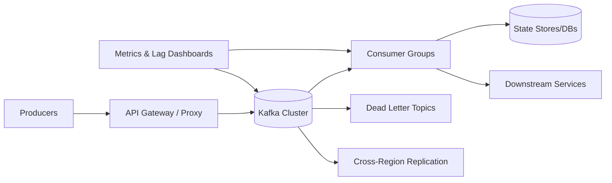

# 05. Async Processing & Kafka Essentials

## Problem Overview
- Decouple synchronous writes from heavyweight processing while guaranteeing ordered, durable event streams.

## Functional Requirements
- Accept producer traffic via REST/Protobuf -> Kafka topics with schema validation.
- Provide consumer groups for downstream services with exactly-once or at-least-once semantics.
- Enable replay/recovery pipelines, dead-letter queues, and schema evolution workflows.

## Non-Functional Goals
- Topic throughput target: 1M msgs/sec aggregate, p99 publish latency < 50 ms.
- Storage retention configurable up to 30 days; compaction for idempotent topics.
- Disaster recovery RPO < 1 minute using cross-region replication.

## Architecture Overview
- Producers use idempotent writes + transactions where ordering matters.
- Kafka cluster sized with dedicated controller quorum (KRaft) + broker pools using SSD/NVMe and tiered storage.
- Consumer services integrate with schema registry, support pause/resume, and apply idempotent processors.

## Data Design & APIs
- Topic taxonomy: `entity.event_type.version`. Partitioning strategy by entity key to preserve order.
- Schema registry enforces compatibility (backward/forward) and captures metadata.
- Control APIs: `POST /topic`, `POST /consumer/rebalance`, `GET /lag` for operations dashboards.

## Implementation Plan
1. Stand up Kafka cluster with observability (Cruise Control, Prometheus exporters, OpenTelemetry tracing).
2. Define topic conventions, ACLs, and schema registry policies; onboard first producers.
3. Build consumer SDK with retry policies, DLQ integration, and metrics hooks.
4. Configure replication + tiered storage for DR; script failover + mirroring drills.
5. Automate lag alerts, load tests, and partition rebalancing workflows.

## Testing & Validation
- Benchmark producer throughput under different batch sizes + compression codecs.
- Simulate broker loss and verify ISR shrink/expansion + client failover behavior.
- Rewind consumer offsets to replay events; confirm downstream idempotency.

## Operational Considerations
- Track key metrics: `producer_throttle_time_ms`, `consumer_lag`, `storage_utilization`, `rebalance_rate`.
- Document runbooks for partition reassignments, schema rollbacks, and DLQ draining.

## Tutorial Deep Dive
### Block Diagram

### Design Walkthrough
- **Producer discipline:** Enforce idempotent writes, batching, compression, and schema validation upfront to keep brokers healthy.
- **Topic topology:** Partition by entity to guarantee ordering where required, use compaction for state-change topics, and retain raw logs for replay.
- **Consumer resiliency:** Implement idempotent processors, explicit offset commits after side effects, and DLQs for poison messages; provide tooling to replay ranges safely.
- **Disaster recovery:** Mirror topics across regions or tier them to object storage, and rehearse failover by switching clients to the secondary cluster.

## Interview Kit
1. **How do you choose partition count?**  
   Balance throughput (partitions × consumer parallelism) against operational overhead; plan headroom for spikes and rebalancing, and document strategy for increasing partitions.
2. **What causes consumer lag spikes and how do you respond?**  
   Lag jumps when downstream services slow, messages grow, or rebalances occur; detect via alerts, scale consumers, throttle producers, or shed optional workloads temporarily.
3. **How would you ensure schema changes don’t break consumers?**  
   Use a registry enforcing compatibility modes, canary producers/consumers, and fall back to DLQ + alert when incompatible payloads sneak through.
