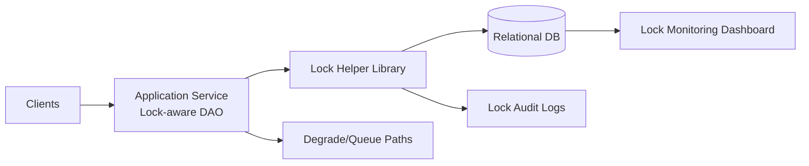

# 07. Pessimistic Locking on Relational Databases

## Problem Overview
- Guarantee serialized updates for high-value rows (payments, inventory) even under contention, using DB-provided locks.

## Functional Requirements
- Expose APIs that wrap `SELECT ... FOR UPDATE` or advisory locks with timeout + retry semantics.
- Provide monitoring of lock wait graphs and deadlocks.
- Allow per-tenant isolation so noisy neighbors cannot starve others.

## Non-Functional Goals
- Keep lock wait p95 under 150 ms under nominal load; deadlock rate <0.1% of transactions.
- Support multi-region deployments with deterministic failover semantics (no double-exec after failover).

## Architecture Overview
- Application services use lock-aware DAO layer that centralizes acquisition/release and includes tracing.
- Lock management dashboard reads from DB views (`pg_locks`, `information_schema.innodb_locks`).
- Optional coordination service issues distributed fencing tokens for multi-DB workflows.

## Data Design & APIs
- Lock request payload: `(resource_id, scope (row/table), lock_mode, timeout_ms, priority)`.
- Metadata tables store lock audit logs and conflict counts.
- API wrappers: `LockContext.runWithLock(resource, fn)` handling retries/backoff.

## Implementation Plan
1. Identify critical tables/indexes that require pessimistic locking and annotate ORM/queries.
2. Build lock helper library with metrics, tracing, and consistent retry envelope.
3. Create dashboards + alerts for lock waits, blocked queries, and deadlock reports.
4. Stress-test by replaying conflicting transactions; tune indexes and query plans.
5. Document fallback strategies (queue requests, degrade features) when lock contention spikes.

## Testing & Validation
- Run concurrency harness issuing thousands of conflicting writes; record throughput vs. contention.
- Force failovers to ensure locks are released and app handles retries.

## Operational Considerations
- Provide procedures for killing runaway transactions safely.
- Educate teams about lock scope/timeouts to avoid global locks in OLTP paths.

## Tutorial Deep Dive
### Block Diagram

### Design Walkthrough
- **Acquisition flow:** Requests enter the lock-aware DAO, which wraps queries with `SELECT ... FOR UPDATE` or advisory locks depending on resource granularity.
- **Timeout strategy:** Standardize lock wait timeout, provide application-level retries with jitter, and log conflicts for later analysis.
- **Visibility:** Surface blocked sessions, lock graphs, and deadlocks via dashboards and trace annotations tied to business operations.
- **Fallbacks:** When contention spikes, queue work, downgrade features, or switch to asynchronous workflows to protect the rest of the system.

## Interview Kit
1. **When would you choose advisory locks over row locks?**  
   When locking spans multiple tables/resources or lives outside a single transaction; advisory locks provide custom granularity but require disciplined release patterns.
2. **How do you detect and break deadlocks early?**  
   Enable database deadlock detection, log victims, and replay workloads to reorder operations or add covering indexes; measure deadlock rate as an SLO.
3. **What’s your strategy for cross-region locking?**  
   Avoid it if possible; otherwise, use a global coordinator with fencing tokens, tolerate higher latency, and design idempotent retries for the elevated failure risk.
