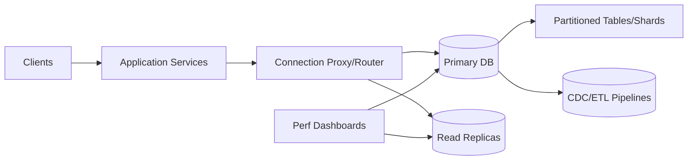

# 09. How to Scale Relational Databases

## Problem Overview
- Extend life of a single logical relational database under rapid workload growth without sacrificing availability.

## Functional Requirements
- Provide roadmap for vertical optimization, read replicas, partitioning, and eventual sharding.
- Enable traffic splitting per database role (primary vs. replicas vs. analytical copies).
- Support online schema migrations and progressive data moves.

## Non-Functional Goals
- Target 99.95% availability through scaling phases.
- Keep replication lag < 200 ms for OLTP replicas.
- Maintain predictable query latency by bounding slow queries (<100 ms p95) via governance.

## Architecture Overview
- Baseline stage: tune indexes, query plans, connection pools, caching.
- Stage 2: add read replicas + routing proxies; stage 3: vertical partitioning by domain; stage 4: full sharding with global router.
- Observability stack collects qps, lock waits, cache hit ratio, replication metrics.

## Data Design & APIs
- Partition maps define table -> shard assignments, stored in config DB.
- Schema migration service exposes `POST /migration` -> orchestrates phases (shadow, verify, cutover).

## Implementation Plan
1. Capture workload diagnostics (pg_stat_statements, slow query logs) and tune indexes + caching.
2. Deploy proxies for read/write splitting; enforce connection budgets.
3. Introduce replicas with lag monitoring + promotion tooling.
4. Partition high-volume tables vertically or horizontally; update routers/services.
5. Plan and execute sharding/region distribution, documenting fallback + data repair processes.

## Testing & Validation
- Run capacity tests for each phase; confirm KPI improvements.
- Simulate replica lag + failover to validate router + cache responses.
- Practice schema migration dry runs with full rollback.

## Operational Considerations
- Maintain runbooks for scaling triggers, e.g., CPU>70%, storage>80%, replica lag> threshold.
- Keep performance budgets shared with application teams to avoid regressions.

## Tutorial Deep Dive
### Block Diagram

### Design Walkthrough
- **Stage 1 optimizations:** Tune queries, indexes, caching, and connection pools before reaching for sharding to maximize existing hardware.
- **Read scaling:** Introduce replicas plus routing logic; define acceptable lag and fallback when replicas drift beyond SLA.
- **Partition & shard:** Split schemas by domain or key to keep working sets hot; update routers and clients gradually to avoid downtime.
- **Ops maturity:** Automate schema changes, add PITR backups, and run chaos drills so each scaling step is reversible.

## Interview Kit
1. **How do you decide between vertical scaling and sharding?**  
   Favor vertical optimizations until marginal gains shrink; when single-node CPU/IO/hardware ceilings block growth or workload isolation is required, plan a shard strategy.
2. **What’s your approach to online schema migrations?**  
   Use tools like gh-ost/pg_repack, run in chunks, monitor replication lag, and keep rollback path ready; coordinate with application deployments.
3. **How would you handle multi-region traffic?**  
   Pin writes to a primary region with async replicas elsewhere, or adopt multi-primary only for workloads that can reconcile conflicts; ensure router is latency-aware.
