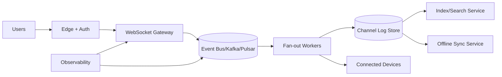

# 12. Designing Slack's Realtime Text Communication

## Problem Overview
- Deliver low-latency chat for large teams: channels with thousands of members, typing indicators, searches, and offline sync.

## Functional Requirements
- Multi-tenant WebSocket gateway handling authentication, presence, typing updates, and message delivery.
- Durable append-only channel logs with per-tenant retention policies and search indexing.
- Read receipts + notifications + offline catch-up flows.

## Non-Functional Goals
- Sub-200 ms delivery latency for in-region users, 99.99% availability.
- Scale to millions of concurrent WebSockets, 1M fan-out per second globally.
- Geo-fencing compliance with tenant pinning.

## Architecture Overview
- Edge layer terminates WebSockets (Envoy) + load balancers with consistent hashing to session pods.
- Message broker (Kafka/Pulsar) fan-outs channel events to fan-out workers.
- Storage: per-channel log segments (S3 + cache) + search index (Elasticsearch) + metadata DB.
- Sync service handles offline clients with delta tokens.

## Data Design & APIs
- Channel log format: `(channel_id, message_id, ts, sender_id, body, thread_id, reactions)`. Secondary indexes for threads.
- APIs: `WS /connect`, `POST /messages`, `GET /history`, `POST /typing`, `POST /ack`.
- Encryption + tenant isolation enforced via workspace tokens.

## Implementation Plan
1. Build authentication + workspace routing handshake flow.
2. Implement channel log storage and fan-out pipeline (append -> broker -> gateway push).
3. Add typing indicators + read receipt events piggybacked on same connections.
4. Integrate search indexing + delta-sync offline flows.
5. Establish observability (lag, connection churn, drop rates) and disaster recovery strategy.

## Testing & Validation
- Simulate 1k-member channel bursts; ensure fan-out stays under 200 ms.
- Run chaos tests causing gateway restarts; confirm clients reconnect transparently.
- Validate offline catch-up by disconnecting clients and verifying message replay.

## Operational Considerations
- Monitor connection pool utilization, per-tenant quotas, backlog growth.
- Provide tooling for tenant migrations, compliance exports, and message retention pruning.

## Tutorial Deep Dive
### Block Diagram

### Design Walkthrough
- **Gateway role:** Terminate connections, authenticate tenants, and apply rate limits before events hit the broker tier.
- **Fan-out strategy:** Partition channels across workers; support replication for large channels and implement backlog cursors so reconnecting clients can replay deltas.
- **Durability:** Append events to per-channel logs stored in blob storage + DB, index asynchronously for search, and apply retention policies per workspace.
- **Reliability:** Provide ack-based delivery for important events, offline sync packages for mobile, and ops tooling for tenant failover or exports.

## Interview Kit
1. **How do you handle a 1,000-member channel spike?**  
   Pre-shard channels by ID, use batching on fan-out, consider sub-channel replication, and monitor per-channel queue depth with automatic scaling.
2. **What ensures typing indicators don’t overload the system?**  
   Throttle client updates, piggyback indicators on existing frames, and drop stale signals if recipients lag to protect message delivery.
3. **How would you migrate a tenant to another region?**  
   Snapshot their data, replay event logs into the new region, dual-write during cutover, and update routing metadata while monitoring connection churn.
