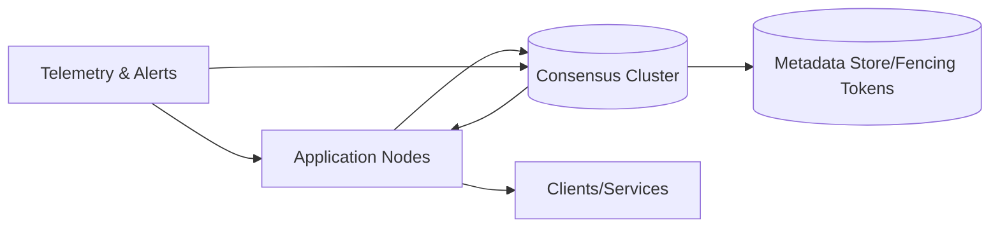

# 15. Leader Election & Self-healing Distributed Systems

## Problem Overview
- Ensure only one node performs critical mutations while peers standby and failover automatically.

## Functional Requirements
- Consensus or coordination service (Raft/etcd/ZooKeeper) issuing leadership leases.
- Nodes must detect failures, trigger elections, and resume work without manual intervention.
- Provide fencing tokens + idempotent state transitions to avoid split-brain updates.

## Non-Functional Goals
- Election convergence < 3× network RTT (typically < 300 ms in-region).
- Support clusters up to 7 voting members with witness observers for WAN replication.
- Guarantee durability of committed state before leader responds.

## Architecture Overview
- Consensus cluster handles log replication + leader selection; application nodes subscribe to leadership changes.
- Health monitors send heartbeats; operations pipeline surfaces state via dashboards.
- Clients interact via virtual IP/service name, abstracting leader location.

## Data Design & APIs
- Metadata store: `leader_status` key storing `(node_id, term, lease_expiry)`.
- APIs for `POST /leadership/stepdown`, `GET /status`, `POST /fence-token/validate`.

## Implementation Plan
1. Choose consensus library or managed service, configure quorum settings + persistence.
2. Instrument nodes with heartbeats, log shipping, and health scoring.
3. Implement fencing-token enforcement in downstream resources (DB writes, locks).
4. Add auto-remediation (node restart, resync) when lagging or unhealthy.
5. Document operational workflows: scaling cluster, replacing nodes, forced failover.

## Testing & Validation
- Induce latency/packet loss to observe election timing and split-brain resilience.
- Kill leaders abruptly; ensure followers promote quickly and clients reconnect.
- Rewind clocks to test lease expiry logic.

## Operational Considerations
- Monitor term changes, election frequency, log replication lag.
- Keep snapshotting/compaction tuned to avoid disk bloat; plan for key rotation + auth on coordination service.

## Tutorial Deep Dive
### Block Diagram

### Design Walkthrough
- **Lease lifecycle:** Nodes register with the coordination cluster, acquire leadership leases, and renew before expiry; fencing tokens guard downstream resources.
- **State replication:** Leaders append to replicated logs; followers apply entries and stay ready to take over. Snapshots control log size.
- **Failure handling:** Heartbeats detect slow/stuck leaders, triggering elections; applications must tolerate temporary unavailability.
- **Observability:** Track terms, election durations, and log lag to catch split-brain or hardware issues early.

## Interview Kit
1. **What determines election timeout values?**  
   Base on network RTT and jitter; timeouts must be long enough to avoid false elections yet short enough for quick failover (typically 3–5× RTT).
2. **How do you prevent dual leaders?**  
   Require majority quorum for term increments, use fencing tokens when touching shared resources, and ensure clients only accept writes from the highest term leader.
3. **When would you use a managed coordinator (e.g., etcd) vs. rolling your own?**  
   Choose managed when time-to-market and reliability trump customization; roll your own only with strong expertise or unique performance constraints.
