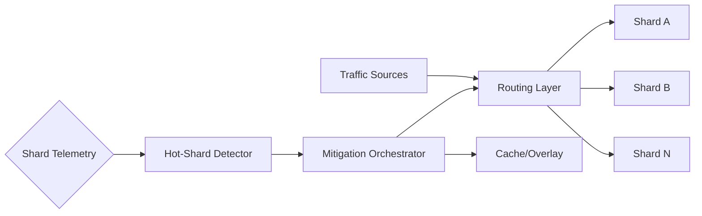

# 18. Handling Hot-Shard Problems

## Problem Overview
- Prevent a subset of partitions from receiving disproportionate load, which causes latency spikes and cascading failures.

## Functional Requirements
- Detect hot shards via telemetry (qps, latency, CPU) and trigger mitigations automatically.
- Provide mitigation strategies: key randomization, dynamic splitting, request rerouting, or caching overlays.
- Communicate SLA downgrade + customer impact when mitigation underway.

## Non-Functional Goals
- Detection latency < 60 seconds; mitigation should restore p99 latency within 5 minutes.
- Ensure rebalancing causes <1% failed requests.

## Architecture Overview
- Metrics pipeline streams shard stats into anomaly detector (Prometheus + Cortex + rules or ML-based system).
- Control plane orchestrates shard splits/migrations and updates routing metadata.
- Cache/proxy tier provides write buffering or queueing while migrations complete.

## Data Design & APIs
- Shard metadata: `(shard_id, key_range, node, capacity, status)` stored in config DB.
- APIs for `POST /shards/{id}:split`, `POST /shards/{id}:move`, `POST /shards/{id}:throttle`.

## Implementation Plan
1. Instrument all shards with consistent metrics; build dashboards + alarms for skew.
2. Implement mitigation catalog (key hashing toggles, caching, traffic shedding) with runbooks.
3. Automate shard split/move workflow: snapshot, copy, cutover, verify.
4. Provide customer communication + SLA downgrade process triggered via incident automation.
5. Run chaos scenarios: targeted traffic skew, node failure during split.

## Testing & Validation
- Replay historical traffic traces with synthetic skew to ensure detector catches anomalies.
- Validate shard split pipeline using staging cluster; measure data copy times.
- Confirm caches/buffers avoid write amplification during moves.

## Operational Considerations
- Monitor routing cache staleness, config propagation delays, and backlog levels.
- Keep capacity headroom (20–30%) per shard to absorb sudden spikes before automation kicks in.

## Tutorial Deep Dive
### Block Diagram

### Design Walkthrough
- **Detection:** Continuously stream shard metrics (QPS, p99 latency, CPU) into anomaly detectors that flag skew beyond thresholds.
- **Mitigation catalog:** Predefine actions—key randomization, cache overlays, shard splitting, or throttling—so automation can trigger quickly.
- **Orchestration:** On trigger, orchestrator updates routing metadata, spins up new shards, or duplicates hot keys across shards while maintaining consistency.
- **Communication:** Expose dashboards and notification hooks so stakeholders know when SLAs are downgraded during mitigation.

## Interview Kit
1. **How do you split a shard with minimal downtime?**  
   Snapshot data, stream CDC changes to new shards, run dual writes, and switch router entries once divergence is acceptably low.
2. **When would you favor caching over resharding?**  
   For temporary hotspots (marketing campaigns) where fronting with cache + TTL solves the issue faster than data movement.
3. **How do you validate mitigation success?**  
   Compare post-mitigation metrics to baseline, ensure automated detectors reset, and audit data correctness for moved/split shards.
