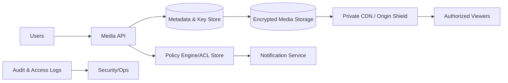

# 20. Implementing Private Photos for Instagram

## Problem Overview
- Enforce fine-grained privacy controls on media access, ensuring only authorized viewers can load private photos while maintaining performance.

## Functional Requirements
- Policy engine supporting ACL types (close friends, followers, custom lists) with real-time checks.
- Short-lived signed URLs tied to viewer identity + policy evaluation.
- Event-driven notifications and caching that respect ACL boundaries.
- Complete audit trail of access, edits, and shares for compliance.

## Non-Functional Goals
- Authorization latency < 30 ms; CDN cache must never leak private assets.
- Access logging retention 1 year with tamper-evident storage.

## Architecture Overview
- Media metadata service stores ACLs + encryption keys per asset.
- Access gateway receives viewer request, validates session, queries policy engine, and issues signed URL with per-device constraints.
- Private CDN or origin shield enforces token verification; encrypted blobs stored in multi-region buckets.
- Notification service uses fan-out respecting ACL membership.

## Data Design & APIs
- ACL table: `(media_id, rule_type, subject_type, subject_id, expires_at)` + compiled policy cache.
- Key management: envelope encryption, storing data keys in KMS per media.
- APIs: `POST /media/{id}/acl`, `GET /media/{id}/view`, `POST /media/{id}/share`.

## Implementation Plan
1. Define privacy models + UI flows; translate to policy schema.
2. Build policy evaluation service with caching + invalidation triggered by ACL updates.
3. Integrate gateway with authentication + signed URL generation; embed viewer claims + TTL.
4. Configure storage encryption, CDN token verification, and redaction of logs.
5. Launch audit + alerting pipelines for anomalous access; run red-team tests.

## Testing & Validation
- Fuzz token generation to ensure tamper resistance.
- Simulate ACL changes while viewers have cached URLs; confirm revocation works.
- Load test policy engine to handle spikes (celebrity posts) without regression.

## Operational Considerations
- Monitor policy cache hit rate, token issuance volume, and unauthorized access attempts.
- Provide emergency procedures to revoke all tokens, rotate keys, and purge CDN caches.

## Tutorial Deep Dive
### Block Diagram

### Design Walkthrough
- **Policy evaluation:** On every request, API queries policy engine to evaluate viewer context, ACL rules, and privacy settings in <30 ms.
- **Token issuance:** Generate short-lived signed URLs referencing viewer ID and scope; CDN/origin validates before streaming bytes.
- **Secure storage:** Encrypt at rest with per-media keys (envelope encryption) and store key references in metadata service.
- **Auditing:** Immutable logs capture every grant/deny; anomaly detection flags unusual access for review.

## Interview Kit
1. **How do you revoke access immediately?**  
   Maintain token blacklist/epoch counters, purge CDN caches, and update policy caches; optionally rotate encryption keys for high-risk assets.
2. **What keeps private media out of shared caches?**  
   Use dedicated origins/CDNs, include viewer-specific tokens in cache key, and disable public caching headers.
3. **How do you expose privacy settings in the product without leaking info?**  
   Serve aggregated hints (e.g., “only close friends”) while keeping exact ACL membership server-side; ensure UI requests only reveal what user can already access.
