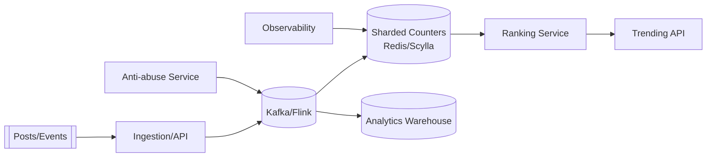

# 22. Designing Concurrent Hashtag Counter

## Problem Overview
- Track trending hashtags under extreme write concurrency while exposing near-real-time rankings.

## Functional Requirements
- Ingest hashtag events (post, comment, story) via streaming pipeline with dedupe + anti-abuse.
- Maintain counts per hashtag + time bucket (1m/1h/1d) with sliding window queries.
- Expose ranking API with pagination, filtering, and pinned tags.

## Non-Functional Goals
- Event ingestion up to 5M events/sec, counter accuracy within 0.5% for top tags.
- Query latency < 100 ms for top 100 results.

## Architecture Overview
- Producers push events -> Kafka -> stream processors (Flink/Kafka Streams) update sharded counters stored in Redis/Scylla.
- Periodic compaction merges per-shard counters into global view stored in OLAP DB for long-term analytics.
- Anti-abuse service flags bots/spam and subtracts events.

## Data Design & APIs
- Counter key format: `{hashtag}:{window_start}`; value includes `count`, `decay_factor`, `last_update`.
- Rankings table in OLAP for historical queries.
- APIs: `GET /trending?window=1h&locale=...`, `POST /hashtags/{tag}/adjust` for moderation.

## Implementation Plan
1. Define ingestion schema + dedupe keys (post_id, user_id) to avoid double counts.
2. Implement stream processors with sharded counters + CRDT (PN-Counter) semantics to avoid conflicts.
3. Build ranking service with sorted sets, applying decay functions for recency.
4. Integrate anti-abuse heuristics + manual moderation overrides.
5. Launch dashboards for event rate, skew, and ranking stability.

## Testing & Validation
- Replay historical spikes to evaluate accuracy + latency.
- Fault-inject node loss or partition and verify CRDT/merge recovers counts.
- Validate ranking API under heavy read load with caching.

## Operational Considerations
- Monitor shard skew, stream lag, Redis memory usage, and accuracy drift.
- Document procedures for manual adjustments, recounts, and incident communication.

## Tutorial Deep Dive
### Block Diagram

### Design Walkthrough
- **Streaming path:** Events enter Kafka, deduped, enriched, and aggregated by stream processors updating sharded counters.
- **Ranking service:** Periodically merges shards, applies decay per window (1m/1h/1d), and exposes APIs with pagination plus locale filters.
- **Anti-abuse:** Apply heuristics (rate limits, anomaly scores) before increments to keep trends meaningful.
- **Historical view:** Persist aggregates to OLAP for auditing, retrospective analysis, and machine learning.

## Interview Kit
1. **How do you reconcile counters after a node crash?**  
   Replay stream offsets for affected shard from Kafka, compare to durable snapshots, and run reconciliation jobs until deltas shrink.
2. **What’s your plan for localized trending?**  
   Partition counters by (hashtag, locale), apply weighting by region population, and ensure APIs allow filtering by geography.
3. **How do you avoid double counting retweets/shares?**  
   Include dedupe keys (user_id, event_id) and reject duplicates within configurable windows; track dedupe hit rate as a health metric.
