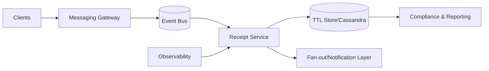

# 23. Designing Message Indicators

## Problem Overview
- Provide typing, sent, delivered, and seen indicators with minimal bandwidth while respecting privacy choices.

## Functional Requirements
- Define indicator state machine and event priorities (typing < sent < delivered < seen).
- Piggyback indicator events on existing messaging channels (WebSocket, MQTT) with rate limiting.
- Persist receipts with TTL for compliance + dispute resolution.
- Allow users to opt out of seen indicators while still tracking internally for reconciliation.

## Non-Functional Goals
- Indicator propagation < 200 ms in same region; bandwidth overhead < 5% of baseline messaging traffic.
- Storage TTL default 30 days with WORM compliance for regulated markets.

## Architecture Overview
- Messaging gateway accepts indicator events, dedupes, and publishes to Kafka.
- Receipt service writes to low-latency store (Cassandra/DynamoDB) keyed by message_id + recipient.
- Fan-out service batches updates per subscriber to avoid floods.

## Data Design & APIs
- Receipt schema: `(message_id, recipient_id, state, timestamp, device_id, ttl)`.
- APIs: `POST /messages/{id}/typing`, `POST /messages/{id}/delivered`, `POST /messages/{id}/seen`, `GET /messages/{id}/receipts`.
- Privacy settings stored per user with policy checks before sending indicators.

## Implementation Plan
1. Define protocol payloads (bitfields) for states + metadata; integrate with client SDKs.
2. Implement gateway that enforces rate limits (e.g., typing updates at most once per 5s) and dedupe.
3. Build receipt storage + TTL sweeper jobs for expiry.
4. Add fan-out aggregator with diff-based updates per conversation.
5. Update clients to render states, handle opt-out, and degrade gracefully offline.

## Testing & Validation
- Simulate slow/ offline clients to ensure ordering remains monotonic.
- Load test typing events in large group chats to confirm batching works.
- Validate privacy toggles by switching settings mid-conversation.

## Operational Considerations
- Monitor indicator lag, drop rates, and storage growth.
- Provide moderation tooling to inspect receipts for abuse investigations with strict access controls.

## Tutorial Deep Dive
### Block Diagram

### Design Walkthrough
- **State machine:** Define ordering (typing < sent < delivered < seen), encode compactly, and ensure upgrades maintain backward compatibility.
- **Transport:** Piggyback indicator events on existing channels, throttle updates, and dedupe jittery clients.
- **Persistence:** Store receipts with TTL to support disputes while keeping storage under control; expose APIs for compliance exports.
- **Fan-out:** Batch per conversation, send only deltas, and degrade optional indicators when system is stressed.

## Interview Kit
1. **How do you respect privacy opt-outs?**  
   Store preferences per user/device, evaluate before emitting seen receipts, and still record internal state for reconciliation without exposing to other participants.
2. **What’s your plan for ordering guarantee?**  
   Tag events with monotonic counters per conversation and discard out-of-order updates unless they carry newer timestamps.
3. **How would you debug missing read receipts?**  
   Trace from client logs -> gateway -> broker -> receipt store, verifying each hop; compare stored receipts vs. fan-out logs to isolate the gap.
