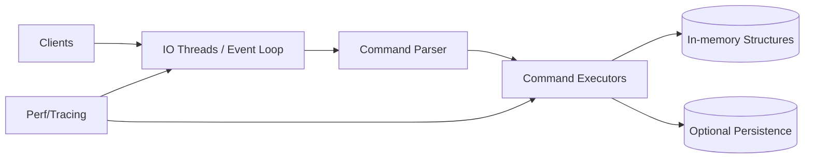

# 25. DiceDB Internals & Maximizing Single-node Performance

## Problem Overview
- Tune a Redis-compatible DiceDB instance for maximum throughput/low latency on single hardware node.

## Functional Requirements
- Profile command pipeline (network, parser, execution) and identify hotspots.
- Enable multi-threaded networking, pipelining, and IO optimizations (io_uring, epoll, sendfile).
- Optimize memory allocator + data structures for cache locality.

## Non-Functional Goals
- Achieve >3M ops/sec on commodity NVMe-enabled server with p99 latency < 1 ms for GET/SET.
- Maintain deterministic latency under 70% CPU utilization to keep headroom.

## Architecture Overview
- Separate networking threads from worker threads; use lock-free queues for command dispatch.
- Implement cluster-friendly features (pipelining, multi-key) without regressions.
- Integrate performance counters and flamegraph tooling.

## Data Design & APIs
- Focus on core commands and modules (streams, hyperloglog) with memory layout improvements.
- Provide runtime configuration toggles for features (multi-threading, persistence) to benchmark combos.

## Implementation Plan
1. Instrument current DiceDB build using perf/ftrace to find syscalls + CPU hotspots.
2. Enable multi-threaded networking (IO threads) and measure throughput; adjust affinity.
3. Swap default allocator with jemalloc/tcmalloc; tune arena sizes and huge pages.
4. Introduce pipelining/autobatching in client libs; evaluate compression for responses.
5. Create benchmarking harness (redis-benchmark/custom) capturing latency histograms + CPU counters.

## Testing & Validation
- Run controlled benchmarks before/after each optimization, capturing flamegraphs.
- Perform stress tests with mixed workloads (writes, Lua scripts, large values) to ensure stability.
- Validate persistence/durability not regressing when enabling optimizations.

## Operational Considerations
- Document recommended kernel/sysctl settings (net.core.somaxconn, TCP backlog, huge pages).
- Provide upgrade path and feature flags to disable risky optimizations quickly.

## Tutorial Deep Dive
### Block Diagram

### Design Walkthrough
- **Pipeline analysis:** Separate networking from execution threads, leverage io_uring or epoll, and minimize context switches.
- **Parser/executor tuning:** Optimize hot paths (SET/GET) with vectorized parsing, command grouping, and lock-free data structures where feasible.
- **Memory hygiene:** Adopt jemalloc/tcmalloc, align data layouts for cache locality, and compress large values when CPU headroom allows.
- **Benchmark harness:** Automate redis-benchmark or custom workloads, collect latency histograms, and integrate perf/flamegraphs for regressions.

## Interview Kit
1. **What limits single-node throughput?**  
   Typically CPU (per-command overhead), network syscalls, or memory bandwidth; profile to identify the dominant factor before optimizing.
2. **How do you evaluate multi-threading benefits?**  
   Measure throughput vs. CPU usage before/after enabling IO/executor threads, ensuring locking overhead doesn’t erase gains.
3. **How to keep latency consistent while optimizing?**  
   Track tail latencies, avoid long GC pauses, and throttle background work (AOF fsync, snapshots) to non-peak windows.
