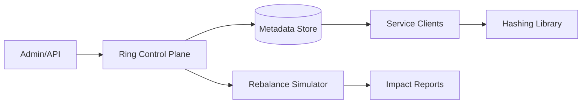

# 26. Operational Complexities of Consistent Hashing

## Problem Overview
- Manage shard placement when relying on consistent hashing, ensuring smooth node churn, balancing, and observability.

## Functional Requirements
- Build hashing ring with virtual nodes + weights, persisted centrally.
- Provide tooling for node add/remove/replace with predicted key movement percentages.
- Detect imbalances and trigger automated rebalancing or alerts.

## Non-Functional Goals
- Ring update propagation < 30 seconds; avoid >5% abrupt key movement for incremental operations.
- Provide 99.99% availability during ring changes with no data loss.

## Architecture Overview
- Control plane stores ring metadata (etcd) and pushes to clients via watch APIs.
- Data plane services embed hashing library (rendezvous/ketama) referencing metadata version.
- Rebalance orchestrator simulates impact, warms new nodes, and migrates data gradually.

## Data Design & APIs
- Ring schema: `(ring_id, node_id, weight, virtual_nodes, status, checksum, version)`.
- APIs: `POST /ring/{id}/node`, `POST /ring/{id}/rebalance`, `GET /ring/{id}/plan` (diff preview).

## Implementation Plan
1. Implement ring metadata service + CLI to inspect/distribute versions.
2. Embed hashing client library for all services with metrics + logging.
3. Build rebalance workflow: plan -> canary -> execute -> validate -> finalize.
4. Add drift detection (skewed load) based on runtime metrics, auto-suggesting weight adjustments.
5. Document runbooks for rollback, data migration, and compatibility testing.

## Testing & Validation
- Simulate node additions/removals at different weights; verify predicted vs. actual movement.
- Inject metadata corruption/delay to ensure clients fallback gracefully.
- Load test rebalancing to confirm no SLA regressions.

## Operational Considerations
- Track version adoption across fleet; alert when stale configs persist.
- Maintain integration tests for hashing library to catch regression in hashing algorithm/digest.

## Tutorial Deep Dive
### Block Diagram

### Design Walkthrough
- **Metadata authority:** Keep ring configuration with versioning and checksums; clients watch for updates and swap atomically.
- **Virtual nodes:** Assign weights via many virtual nodes to smooth distribution; expose tooling to calculate movement percentages before changes.
- **Lifecycle:** Node add/remove flows involve pre-warming, data migration, and finalizing by updating the ring plus verifying key counts.
- **Observability:** Simulator plus runtime metrics reveal skew, stale configs, and time to convergence.

## Interview Kit
1. **How do you handle simultaneous node failures?**  
   Pre-plan capacity headroom, allow emergency weight adjustments, and have repair tooling to redistribute keys quickly.
2. **What’s the cost of too few virtual nodes?**  
   Leads to uneven key distribution; increase virtual node count or adopt rendezvous hashing for smoother results.
3. **How do clients know they’re on the latest ring?**  
   Embed version numbers in configs, expose `/status` endpoints, and alert when clients lag beyond threshold; optionally require handshake before serving traffic.
