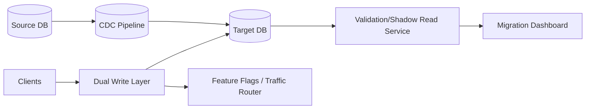

# 27. No Downtime Data Migration

## Problem Overview
- Move datasets or schema changes without user-visible outages while preserving correctness.

## Functional Requirements
- Support migration strategies: dual writes, change data capture (CDC), blue/green cutovers.
- Provide validation pipelines (shadow reads, diffing) and abort criteria.
- Automate communication + toggles for gradual traffic shifting.

## Non-Functional Goals
- Max acceptable data divergence 0; detection latency < 1 minute.
- Rollback RTO < 5 minutes.

## Architecture Overview
- Source writes mirrored via CDC into target; dual-write if feasible with idempotent operations.
- Validation service compares samples or full tables (checksum) and reports drift.
- Traffic router gradually shifts reads/writes to target once validation passes.

## Data Design & APIs
- Migration manifest: `(migration_id, scope, phases, metrics, abort_thresholds)` stored in control DB.
- APIs: `POST /migrations`, `POST /migrations/{id}/advance`, `POST /migrations/{id}/abort`, `GET /migrations/{id}/status`.

## Implementation Plan
1. Classify migration type (schema-only, data move, storage replatform) and pick strategy.
2. Build migration runner orchestrating phases: prepare, backfill, dual write, shadow read, cutover, cleanup.
3. Implement validation connectors (row-level diff, aggregation audits) tied to SLAs.
4. Automate feature flags/traffic routing (Envoy, service mesh) for cutover.
5. Document rollback + communication plan (status pages, stakeholder alerts).

## Testing & Validation
- Dry-run on staging/partial dataset; capture metrics and refine thresholds.
- Chaos test by injecting CDC lag or schema mismatch; ensure detection triggers abort.
- Validate monitoring/alerting for divergence and migration progress.

## Operational Considerations
- Keep migrations small/batch to reduce blast radius; maintain calendar + approval workflow.
- Store artifacts/logs per migration for audit and lessons learned.

## Tutorial Deep Dive
### Block Diagram

### Design Walkthrough
- **Mirroring:** Begin with CDC or dual writes from source to target, ensuring order and idempotency.
- **Validation:** Shadow read from target, compare checksums or sampled rows, and expose drift metrics for go/no-go decisions.
- **Cutover:** Use feature flags or routers to shift reads/writes gradually; keep abort switch ready.
- **Cleanup:** After confidence window, disable dual writes, decommission old resources, and archive migration artifacts.

## Interview Kit
1. **How do you detect silent divergence?**  
   Run continuous diff jobs, compare aggregates, and alert on mismatches; maintain historical drift metrics.
2. **What’s your rollback plan?**  
   Keep source authoritative until validation passes, flip traffic with the ability to immediately revert flag, and ensure writes continue to source during rollback.
3. **How do you migrate huge tables without downtime?**  
   Copy snapshots in chunks, apply CDC to catch up, run throttled validation, and schedule cutover during low traffic while dual-writing to cover the gap.
