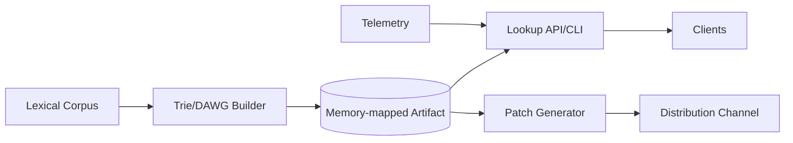

# 28. Designing a Word Dictionary Without a Database

## Problem Overview
- Serve word lookups (exact, prefix, fuzzy) using file-based or in-memory indexes instead of a traditional database.

## Functional Requirements
- Support prefix/suffix search, word definitions, metadata (part of speech, examples).
- Provide offline distributable artifact (compressed file) plus optional in-memory service.
- Enable incremental updates via patch files.

## Non-Functional Goals
- Query latency < 5 ms for in-memory lookups, < 30 ms for file-mapped.
- Artifact size < 200 MB for base language pack.

## Architecture Overview
- Use double-array trie (DAWG) or succinct data structure stored in memory-mapped file.
- Metadata/definitions stored in separate compressed block file with offsets from trie nodes.
- Build CLI/server exposing HTTP API; clients can download zipped artifact for offline use.

## Data Design & APIs
- Trie node IDs map to offsets in definition file; include bitmasks for word termination and part-of-speech flags.
- APIs: `GET /lookup?word=`, `GET /prefix?text=`, `GET /random?filters=`.
- Update packages contain delta instructions (add/remove words) applied via patcher.

## Implementation Plan
1. Build ingestion pipeline: parse lexical dataset -> sorted list -> DAWG builder -> metadata packer.
2. Implement runtime library that memory-maps files, exposes query methods, and caches frequent prefixes.
3. Develop patch format + updater to apply incremental releases without shipping full dataset.
4. Package CLI/server with HTTP endpoints + gRPC for mobile clients.
5. Set up build system + CI to regenerate artifacts and run regression tests.

## Testing & Validation
- Validate correctness using golden lists + random fuzz queries.
- Measure latency/memory footprint on target hardware; tune compression vs. CPU trade-offs.
- Test patch application with corrupt/unexpected sequences.

## Operational Considerations
- Provide versioning + compatibility policy; sign artifacts for integrity.
- Document localization pipeline for additional languages and fallback behavior for missing words.

## Tutorial Deep Dive
### Block Diagram

### Design Walkthrough
- **Build pipeline:** Normalize corpus, sort lexicographically, and generate compressed trie/DAWG structures with offsets into definition blocks.
- **Runtime:** Memory-map artifacts for fast startups; expose APIs for exact/prefix/fuzzy searches using precomputed metadata.
- **Updates:** Publish delta patches derived from trie diffs; clients apply sequential patches to stay current without redownloading.
- **Distribution:** Sign artifacts, host via CDN/package manager, and allow offline installs for mobile/embedded use cases.

## Interview Kit
1. **How do you support fuzzy search efficiently?**  
   Precompute phonetic hashes or use BK-trees over the lexicon to limit search space, then fetch definitions via offsets.
2. **What happens when artifact format needs to change?**  
   Version headers, maintain backward-compatible readers, and provide migration tooling to rewrite caches or re-download dictionaries.
3. **How do you handle localized content?**  
   Build per-language artifacts, share infrastructure, and allow fallback to master language when specific entries are missing.
