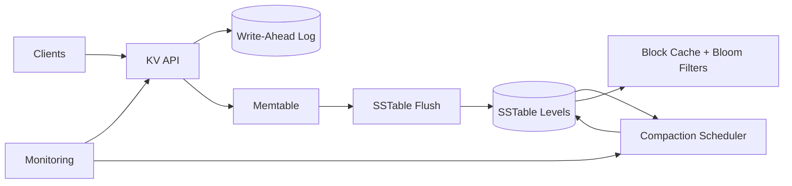

# 29. Designing a Log-Structured KV Store

## Problem Overview
- Build an LSM-based key-value store emphasizing write throughput, compaction efficiency, and predictable latency.

## Functional Requirements
- Write path: WAL + memtable + SSTable flush with configurable compression.
- Read path: bloom filters, block cache, prefix iterators.
- Background compaction (leveled/tiered) with throttling; support TTL + snapshots.
- Provide replication + repair hooks for distributed deployments.

## Non-Functional Goals
- Achieve >200k writes/sec per node, p99 read latency < 5 ms for cached data.
- Keep write amplification < 20x via compaction tuning.

## Architecture Overview
- Components: WAL, in-memory memtables (skip list or ART), immutable SSTables, compaction scheduler, caching tier.
- Metadata service tracks table manifests, version edits, and tombstones.
- Optional distributed mode replicates SSTables via shared storage or streaming.

## Data Design & APIs
- SSTable format with index, bloom filter, data blocks; manifest describing levels.
- APIs: `Put`, `Get`, `Delete`, `Iterate`, `CompactRange`, `CreateSnapshot`.

## Implementation Plan
1. Implement WAL + memtable with flush triggers (size, interval) and concurrency controls.
2. Define SSTable writer/reader plus manifest management; add bloom filters + block cache.
3. Build compaction scheduler supporting tiered + leveled modes with rate limiting.
4. Add replication hooks (raft or shipping SSTables) and repair tools.
5. Expose admin CLI/metrics for compaction stats, cache hit ratio, WAL lag.

## Testing & Validation
- Run YCSB-style benchmarks to measure throughput + latency; tune compaction.
- Simulate crashes mid-flush to ensure WAL recovery works.
- Validate TTL + snapshots by replaying workloads.

## Operational Considerations
- Monitor compaction queues, disk IO, CPU, and read amplification; configure alerts.
- Provide tooling for live debugging (SSTable dump, key history) and safe capacity expansion.

## Tutorial Deep Dive
### Block Diagram

### Design Walkthrough
- **Write pipeline:** Append to WAL, update memtable, and flush to SSTables based on size/time triggers; keep WAL durable for crash recovery.
- **Read optimization:** Consult bloom filters and block cache before hitting storage; merge iterators across levels to return results.
- **Compaction:** Schedule leveled/tiered compactions, throttle to protect foreground latency, and track write amplification.
- **Maintenance:** Support snapshots, TTLs, and repair tools for corrupted SSTables or missing files.

## Interview Kit
1. **How do you choose between leveled and tiered compaction?**  
   Leveled gives better read amplification for read-heavy workloads, while tiered favors write throughput; pick per deployment or allow runtime switch.
2. **What safeguards exist for WAL corruption?**  
   Include checksums, replicate WAL to secondary disks, and keep last good snapshot for quick restore.
3. **How do you debug high read amplification?**  
   Inspect table stats, look for tombstone buildup, enlarge block cache, or tune compaction thresholds to reduce overlapping ranges.
