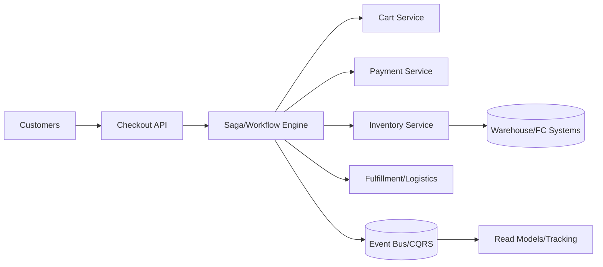

# 31. Designing Multi-tiered Orders for Amazon

## Problem Overview
- Orchestrate shopping cart, payment, inventory, fulfillment, and post-order services across microservices with guaranteed state transitions.

## Functional Requirements
- Domain decomposition: Cart, Pricing, Payments, Inventory, Fulfillment, Notifications.
- Event-driven architecture with sagas/compensation for distributed transactions.
- Expose APIs for order placement, status tracking, cancellations, and returns.

## Non-Functional Goals
- 99.99% availability for checkout, p95 latency < 500 ms under 10k orders/sec.
- Ensure financial correctness (no double charges) and inventory integrity (<0.01% oversell).

## Architecture Overview
- API gateway receives order; orchestrator service (workflow engine) triggers domain services sequentially or in parallel.
- Event bus (Kafka/SNS) propagates state transitions; read models (CQRS) power customer order tracking.
- Data stores per domain (payments -> PCI vault, inventory -> strongly consistent DB, fulfillment -> async queue). 

## Data Design & APIs
- Order aggregate: `(order_id, customer_id, state, line_items, payment_ids, shipment_ids, audit_log)`.
- Saga definition includes steps, compensations, timeouts stored in workflow DB.
- APIs: `POST /orders`, `GET /orders/{id}`, `POST /orders/{id}/cancel`.

## Implementation Plan
1. Model state machine + sagas for major flows (standard purchase, backorder, digital goods).
2. Implement domain services with contracts/events and idempotent handlers.
3. Build orchestrator/workflow engine (Temporal/Cadence) with retries + compensations.
4. Add projections/search indexes for customer service + analytics.
5. Integrate monitoring (business KPIs, saga success, payment/inventory discrepancies) and incident workflows.

## Testing & Validation
- Run chaos experiments: payment declines, inventory shortages, partial fulfillment.
- Load test at peak sale traffic; ensure saga throughput + event bus capacity.
- Simulate compensation scenarios, verifying funds + inventory restored.

## Operational Considerations
- Monitor saga backlog, inventory snapshot accuracy, payment error rates.
- Provide feature flags for promotions, kill switches, and degrade paths (queueing orders) during flash sales.

## Tutorial Deep Dive
### Block Diagram

### Design Walkthrough
- **Domain boundaries:** Separate cart, pricing, payment, inventory, and fulfillment contexts; each owns its database and APIs.
- **Saga orchestration:** Workflow engine sequences steps, retries idempotently, and triggers compensations (refund, restock) on failure.
- **State projections:** Build read models for customer tracking and customer service dashboards fed by event bus.
- **Reliability:** Include kill switches, degrade modes (queue requests), and near-real-time telemetry for war-room operations.

## Interview Kit
1. **How do you avoid double-charging customers?**  
   Payments must be idempotent; include idempotency keys, confirm bank response before marking order as paid, and only capture funds when inventory is secured.
2. **What prevents overselling inventory?**  
   Reserve units atomically, set expirations, and reconcile with warehouse systems; degrade to waitlist when inventory uncertain.
3. **How do you debug a stuck order?**  
   Inspect saga state machine, check pending step/responses, and trace events through the bus; tooling should allow reruns or manual compensation.
