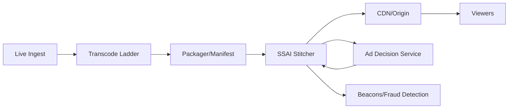

# 33. Ads in Live Streaming

## Problem Overview
- Insert personalized ads into live video streams without increasing buffering or violating ad contracts.

## Functional Requirements
- Server-side ad insertion (SSAI) pipeline orchestrating ingest -> transcode -> packager -> manifest manipulation.
- Decisioning service integrates targeting, pacing, and frequency capping per viewer.
- Measurement beacons + fraud detection; fallback slates when ads unavailable.

## Non-Functional Goals
- Additional latency budget < 500 ms per break; fail open with slate if ad late.
- Handle millions of concurrent viewers with per-viewer manifests (HLS/DASH), 99.95% availability.

## Architecture Overview
- Live ingest pushes RTMP to encoder -> transcode ladder -> origin packager.
- Ad decision service receives request with viewer profile, returns VAST/VMAP creative; SSAI stitcher splices segments, updates manifest with SCTE-35 markers.
- CDN caches segments; analytics pipeline ingests beacons for reporting.

## Data Design & APIs
- Decision API payload: `(viewer_id, geo, device, content_id, break_id, time_remaining)` -> `ad_pod` with creatives + tracking URLs.
- Manifest manipulator stores timeline metadata for auditing.
- Logging schema captures `ad_id`, `impression`, `quartiles`, `errors`.

## Implementation Plan
1. Implement SCTE-35 marker extraction + scheduling around live events.
2. Build SSAI stitcher capable of transcoding ads to match bitrate ladder + DRM.
3. Integrate ad decision engine (internal or third-party) with caching + fallback rules.
4. Deploy measurement/anti-fraud (beacon validation, dedupe, anomaly detection).
5. Establish QoE monitoring (rebuffering, start-up), and fallback to slates when issues detected.

## Testing & Validation
- Run rehearsal streams with injected ad pods; measure latency + manifest accuracy.
- Simulate ad server slowness to confirm fallback slates appear quickly.
- Validate measurement data vs. ground truth.

## Operational Considerations
- Monitor ad fill rate, average latency, beacon success, and viewer QoE metrics.
- Maintain playbooks for creative ingestion issues, DRM errors, and event scaling.

## Tutorial Deep Dive
### Block Diagram

### Design Walkthrough
- **Pipeline alignment:** Ads must match rendition bitrate/DRM; SSAI stitcher rewrites manifests and prepares slate fallback segments.
- **Decisioning:** Collect viewer context, query ad server with timeouts, and use caching/pacing to avoid late/no-fill scenarios.
- **Measurement:** Emit quartile beacons, feed anti-fraud service, and reconcile with ad platforms for billing accuracy.
- **Quality of experience:** Keep added latency minimal, support fallback slates, and degrade gracefully when ad stack is unhealthy.

## Interview Kit
1. **How do you handle ad decision latency spikes?**  
   Apply strict timeouts, prefetch campaigns, and fall back to slates; monitor and dynamically adjust ad pod lengths.
2. **What’s the difference between SSAI and CSAI trade-offs?**  
   SSAI centralizes stitching and is harder to block but more complex, while CSAI shifts logic to clients but risks inconsistent playback and ad blockers.
3. **How do you detect fraudulent ad traffic?**  
   Validate beacons against session data, compare with CDN logs, and use anomaly detection on engagement metrics; feed suspicious events to review pipelines.
