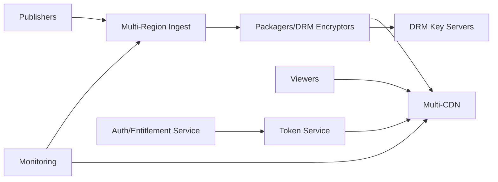

# 34. Privacy & High Availability in Live Streaming

## Problem Overview
- Protect live streams with encryption, access control, and geo policies while maintaining uninterrupted playback despite failures.

## Functional Requirements
- DRM/tokenized access flows with per-viewer keys, watermarking, and revocation.
- Geo/IP/device enforcement plus privacy-preserving analytics.
- Multi-region ingest, redundant packagers/CDNs, automatic failover for player endpoints.

## Non-Functional Goals
- 99.99% availability for tier-1 events; failover < 10 seconds between regions.
- Ensure keys rotate every few minutes; compromise blast radius minimal.

## Architecture Overview
- Auth service issues playback tokens referencing entitlements + policy.
- Ingest points feed into dual (hot-hot) packaging clusters; DRM key servers replicate securely.
- CDN multi-homing with real-time QoE telemetry; control plane can shift traffic.

## Data Design & APIs
- Token payload: `(viewer_id, entitlements, geo, expiry, signature)`; signed + optionally encrypted.
- DRM license service gRPC/REST returning short-lived keys; logs stored in WORM storage.
- QoE telemetry schema: `(viewer_id hash, session_id, bitrate, rebuffers, errors, region)` with privacy safeguards.

## Implementation Plan
1. Implement auth/token service integrated with subscriber data + DRM providers.
2. Deploy multi-region ingest + packaging infrastructure, sharing manifests/state via distributed KV.
3. Build QoE control plane to monitor health and trigger region failover + CDN steering.
4. Add privacy tooling (auditing, anonymization, key rotation) & compliance automation.
5. Conduct disaster recovery drills (region loss, key leak) and tune runbooks.

## Testing & Validation
- Simulate token theft; confirm revocation + re-issue pipeline works quickly.
- Run failover tests moving live traffic between regions while measuring QoE impact.
- Validate geo-fencing accuracy across VPN/edge cases.

## Operational Considerations
- Monitor key server load, license issuance latency, token errors, QoE metrics.
- Maintain emergency key rotation + CDN reroute procedures.

## Tutorial Deep Dive
### Block Diagram

### Design Walkthrough
- **Security layer:** Auth service issues viewer-specific tokens, DRM licenses, and geo/IP checks before CDN grants access.
- **Redundancy:** Duplicate ingest + packagers across regions, use hot-hot setups, and replicate keys securely to avoid single point of failure.
- **Monitoring/automation:** QoE telemetry drives auto-failover; when region fails, reroute traffic and spin up additional capacity automatically.
- **Incident readiness:** Key leak drills, geo-fencing updates, and runbooks keep privacy and availability balanced.

## Interview Kit
1. **How do you rotate DRM keys without buffering viewers?**  
   Use overlapping key windows, push new keys ahead of time, and coordinate with players so they fetch before current key expires.
2. **What metrics signal privacy breaches?**  
   Unexpected token issuance spikes, geo anomalies, or DRM errors; pair with WAF/CDN logs to detect scraping attempts.
3. **How would you handle full-region outage mid-event?**  
   Promote standby ingest/packagers, update DNS/Anycast, warm CDN caches in secondary regions, and communicate to ops + partners immediately.
