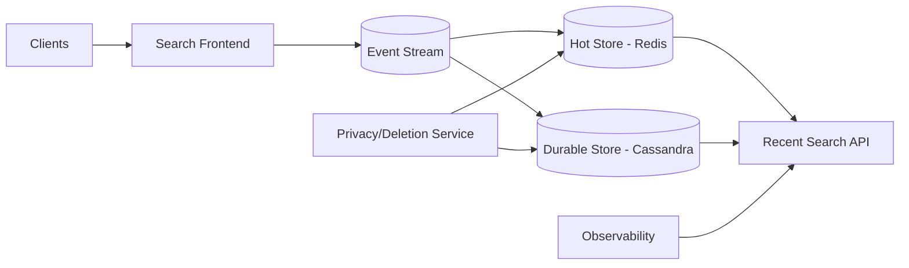

# 35. Designing Recent Searches

## Problem Overview
- Store and surface per-user search history for personalization and quick recall with privacy controls.

## Functional Requirements
- Capture search queries with metadata (timestamp, device, locale) and deduplicate sequential repeats.
- Provide APIs for listing, clearing, and exporting history; respect retention policy (e.g., 90 days default).
- Support personalization signals (recency weighting) feeding autocomplete.

## Non-Functional Goals
- p95 API latency < 50 ms; handle 100k writes/sec per region.
- Guarantee encryption at rest + in transit, compliance with GDPR/CCPA deletion timelines.

## Architecture Overview
- Ingestion service writes to append-only log -> stream processor -> storage (Redis for hot, Cassandra/Bigtable for durable).
- Read path queries per-user partition; caches top results for fast UI rendering.
- Privacy service enforces per-user settings and deletion jobs.

## Data Design & APIs
- Schema: `(user_id, query, normalized_query, timestamp, locale, metadata)` partitioned by user.
- APIs: `GET /users/{id}/recent-searches`, `DELETE /users/{id}/recent-searches`, `POST /users/{id}/settings`.
- TTL indexes for automatic expiry.

## Implementation Plan
1. Instrument search frontend to emit events with dedupe token + privacy flags.
2. Build ingestion + stream processing to normalize queries and push to storage tiers.
3. Implement API service with caching, ranking (recency × frequency), and pagination.
4. Add privacy controls: settings UI, delete requests, audit logging, encryption keys.
5. Monitor usage + adjust retention; integrate feedback loops for personalization models.

## Testing & Validation
- Load test writes/reads; verify partition balance.
- Run deletion tests ensuring data removed from all storages + caches.
- Validate ranking algorithm vs. metrics (click-through).

## Operational Considerations
- Monitor storage growth, TTL expiry rates, encryption health, deletion backlog.
- Provide tools for compliance exports and customer support requests.

## Tutorial Deep Dive
### Block Diagram

### Design Walkthrough
- **Dual storage:** Keep recent entries in Redis for snappy suggestions and sync to Cassandra/Bigtable for durability and analytics.
- **Ranking:** Score by recency × frequency, dedupe sequential identical queries, and expose pagination/cursors.
- **Privacy:** Honor retention windows, allow user-triggered deletions that propagate to both stores, and log compliance operations.
- **Observability:** Track per-user storage, query latency, and encryption health to preempt issues.

## Interview Kit
1. **How do you ensure deletions propagate everywhere?**  
   Emit deletion events to a privacy service, delete from hot store immediately, mark in durable store, and audit for lag.
2. **What if a tenant needs longer retention?**  
   Parameterize TTL per tenant, ensure storage capacity planning accounts for this, and gate via configuration + approvals.
3. **How would you secure PII in logs?**  
   Tokenize or hash user IDs, redact raw queries where not needed, and restrict log access via RBAC plus data retention policies.
