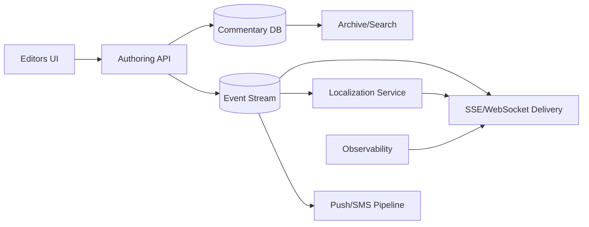

# 36. Designing Cricbuzz's Text Commentary

## Problem Overview
- Stream ball-by-ball cricket commentary with low latency, editorial controls, and localization for millions of readers.

## Functional Requirements
- Content authoring tools for commentators with structured schema (over, ball, event type, text, media links).
- Moderation workflow, translation/localization pipeline, and push notifications.
- Delivery stack (SSE/WebSocket) with caching and offline fallback (SMS/push snippet).

## Non-Functional Goals
- Publish commentary updates < 2 seconds after entry; 99.95% availability during major matches.
- Support multi-language output with consistent sequencing.

## Architecture Overview
- Authoring UI -> API -> write buffer (Postgres) -> event bus (Kafka) -> fan-out services.
- Localization service auto-translates using ML + human corrections; versioned content stored for audits.
- Edge caches/CDN serve long-polling/SSE responses; fallback to push notifications.

## Data Design & APIs
- Commentary schema: `(match_id, innings, over, ball, event_type, text, locale, assets, created_by, corrected_by)`.
- APIs: `POST /matches/{id}/events`, `GET /matches/{id}/commentary?cursor=`, `POST /matches/{id}/alerts`.
- Notification templates parameterized by event type.

## Implementation Plan
1. Build structured editor with validations (ball order, legal states) and autosave.
2. Implement moderation + localization workflow (queues, approvals, translation memory).
3. Set up event streaming -> SSE/WebSocket delivery with delta responses + caching headers.
4. Integrate scoreboard + push notifications to ensure parity (common data source for runs/wickets).
5. Instrument latency, accuracy, and translator/editor throughput; create ops dashboards.

## Testing & Validation
- Dry-run commentary for archived matches; verify ordering across locales.
- Load test live delivery at major event scale; include failover to SMS/push.
- Audit translation accuracy and editorial override flows.

## Operational Considerations
- Provide runbooks for connectivity loss at venues, translator staffing, and scoreboard discrepancies.
- Monitor localization queues, SSE disconnect rates, and push notification deliveries.

## Tutorial Deep Dive
### Block Diagram

### Design Walkthrough
- **Structured authoring:** Editors post structured events (over, ball, text); validations enforce order and data quality.
- **Localization:** Auto-translate with ML, queue for human edits, and version events so translations stay aligned with source.
- **Delivery:** SSE/WebSocket services push updates under 2s; fallback channels (push, SMS) ensure reach even when data networks degrade.
- **Parity:** Scoreboard, commentary, and notifications share event feed to keep states consistent; monitoring flags divergence.

## Interview Kit
1. **How do you recover from an editor going offline mid-over?**  
   Provide offline drafts, autosave to local storage, and allow another editor to pick up via collaborative locking.
2. **What ensures translations stay in sync?**  
   Use event IDs, store translation revisions, and propagate corrections via the same event stream so clients update gracefully.
3. **How do you handle surges during big matches?**  
   Autoscale delivery nodes, cache latest few overs for quick catch-up, and use CDN for static assets (photos/highlights).
