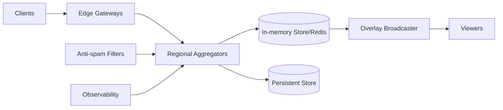

# 37. Instagram Live Reactions

## Problem Overview
- Capture billions of emoji taps during live streams and render smooth overlays without overwhelming network or clients.

## Functional Requirements
- Batch reactions on client, send aggregated deltas periodically (e.g., every 250 ms) tagged by stream + emoji.
- Regional aggregators maintain sharded counters with optional CRDT semantics; push smoothed values to broadcasters & viewers.
- Persist aggregated stats for analytics + replays.

## Non-Functional Goals
- Round-trip latency < 500 ms to keep overlays responsive.
- System must handle >5M reactions/sec globally and degrade gracefully.

## Architecture Overview
- Clients accumulate taps -> send batched payload to edge -> aggregator (in-memory + Redis) increments counters.
- Aggregators push periodic frames to overlay service (WebSocket) which renders animation hints.
- Background jobs persist aggregated windows (per 1s) to data warehouse.

## Data Design & APIs
- Reaction payload: `(stream_id, viewer_id, emoji_id, count_since_last, timestamp)`.
- Aggregated store: `(stream_id, emoji_id, window_start, count, normalized_rate)`.
- APIs: `POST /reactions`, `WS /streams/{id}/reactions`, `GET /streams/{id}/reactions/history`.

## Implementation Plan
1. Update client SDK to batch & compress reaction payloads + enforce rate limits.
2. Deploy regional aggregators with sharded counters (Redis cluster) using LUA scripts for atomic increments.
3. Build overlay broadcaster service smoothing counts and handling dropouts.
4. Persist aggregated time-series to OLAP store; expose analytics dashboards.
5. Add anti-spam (rate thresholds, anomaly detection) and fallback to static hearts when overloaded.

## Testing & Validation
- Stress test aggregator with synthetic taps to ensure CPU/memory suffices.
- Simulate packet loss + reconnect storms; confirm overlay smoothing prevents jitter.
- Validate data integrity by comparing aggregated counts vs. ground truth sample.

## Operational Considerations
- Monitor per-region QPS, aggregator lag, Redis memory, overlay delivery latency.
- Provide runbooks for scaling up shards, muting abusive viewers, and draining streams.

## Tutorial Deep Dive
### Block Diagram

### Design Walkthrough
- **Client batching:** SDK batches taps (counts + emoji) and sends at steady cadence with backoff/jitter to smooth network impact.
- **Aggregation:** Regional services increment sharded counters, applying CRDT semantics to merge across regions without conflict.
- **Overlay pipeline:** Broadcaster samples counts every 200–500 ms, smooths deltas, and pushes overlay hints to player surfaces.
- **Persistence:** Aggregated stats land in OLAP for creator analytics and ML feedback loops.

## Interview Kit
1. **How do you prevent bots inflating counts?**  
   Throttle per-device, use anomaly detection (entropy of emojis, device fingerprints), and allow moderators to mute offenders quickly.
2. **What if packet loss causes client drift?**  
   Clients resend last delta after reconnect; aggregator dedupes via sequence numbers to avoid double counting.
3. **How do you keep overlays smooth under high variance?**  
   Apply exponential moving averages, cap max delta per tick, and degrade to aggregated hearts when CPU/network saturates.
