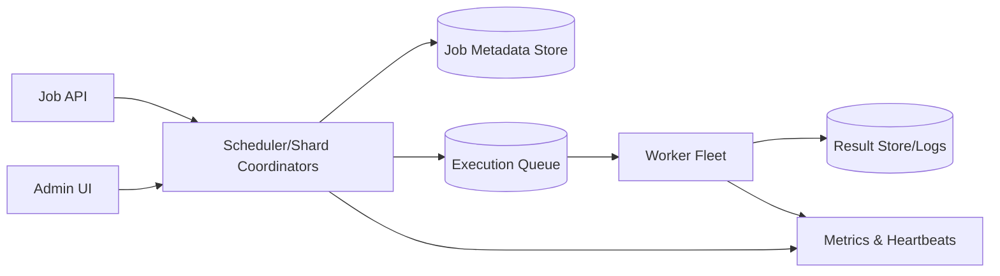

# 38. Designing Distributed Task Scheduler

## Problem Overview
- Execute scheduled jobs across a fleet reliably, ensuring deduplication, retries, and observability.

## Functional Requirements
- Job metadata with cron expressions, time zones, payloads, retry policies, idempotency keys.
- Leader election or sharded ownership so only one worker triggers a job per schedule.
- APIs for pause/resume, run-now, rate limiting, and status queries.

## Non-Functional Goals
- Schedule accuracy within ±1 second for high-priority jobs; handle 1M schedules.
- Ensure once-and-only-once execution semantics (via idempotency) even across failovers.

## Architecture Overview
- Scheduler service uses distributed lock/leader to compute due jobs; stores metadata in SQL/NoSQL DB with indexes on next_run.
- Job queue (Kafka/SQS) carries execution payloads to worker fleet; workers ack/completion events recorded.
- Observability stack collects metrics per job, failure reasons, and SLA breaches.

## Data Design & APIs
- Job schema: `(job_id, owner, cron, timezone, payload, retry_policy, next_run, status, history)`.
- APIs: `POST /jobs`, `PATCH /jobs/{id}`, `POST /jobs/{id}:pause`, `POST /jobs/{id}:runNow`, `GET /jobs/{id}`.

## Implementation Plan
1. Design metadata store + cron evaluator supporting calendars/holidays.
2. Implement scheduler loop (per shard) acquiring leadership or using consistent hashing for job ownership.
3. Build worker runtime with visibility (heartbeat, concurrency limits) and idempotent execution wrappers.
4. Create admin UI/logging for job history, alerts, and multi-tenant quotas.
5. Add disaster recovery: checkpoint scheduler state, replicate metadata, rehearse failover.

## Testing & Validation
- Simulate skewed cron schedules (top of minute) to test batching & smoothing.
- Kill scheduler leaders mid-run; confirm failover + no double triggers.
- Run load test with 1M jobs and random jitter; monitor latency.

## Operational Considerations
- Monitor scheduler lag, job failure ratios, queue depth, worker health.
- Provide runbooks for manual replays, stuck jobs, and capacity expansion.

## Tutorial Deep Dive
### Block Diagram

### Design Walkthrough
- **Metadata & sharding:** Jobs stored with cron, timezone, retries; scheduler shards ownership via consistent hashing or leader election.
- **Dispatch:** Due jobs enqueued onto message bus/queue; workers pick respecting rate limits and concurrency.
- **Idempotency:** Workers wrap payload execution in safeguards, emitting completion or retry events; results stored for auditing.
- **Visibility:** UI surfaces next run, failures, and allows pause/resume/run-now actions.

## Interview Kit
1. **How do you prevent double execution?**  
   Store job executions with idempotency keys, ensure scheduler leadership is exclusive, and have workers check/mark state atomically.
2. **What if a cron burst schedules thousands simultaneously?**  
   Bucket start times with jitter, enforce per-tenant rate limits, and auto-scale workers to spread load.
3. **How do you recover orphaned jobs after leader crash?**  
   Persist scheduler state, use leases, and on failover rebuild due job heap from metadata store before resuming dispatch.
