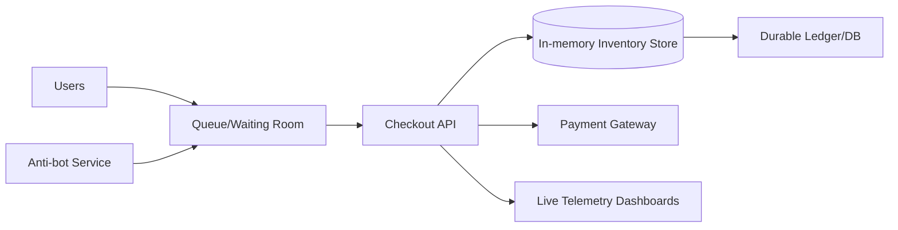

# 39. Designing & Implementing Flash Sale

## Problem Overview
- Handle extreme traffic spikes for limited-inventory events while preserving fairness and preventing oversell.

## Functional Requirements
- Queueing/waiting-room system with pre-registration, captcha, and throttled admissions.
- Real-time inventory service using in-memory transactional store with optimistic locking or reservation tokens.
- Degraded UX states (progress indicators, fallback) and live telemetry dashboards.
- Automated kill switches + rollback.

## Non-Functional Goals
- Sustain >100× normal traffic; limit oversell <0.001%.
- Keep page/API latency < 1s for queued users, < 300 ms once admitted.

## Architecture Overview
- Edge queue service issues position tokens; only top-of-queue can hit checkout APIs.
- Inventory microservice backed by Redis/VoltDB with atomic decrement + TTL reservations; writes to durable log.
- Telemetry pipeline monitors qps, drop rates, conversion, system health.

## Data Design & APIs
- Queue token: `(user_id, queue_id, position, issue_time, expiry)` stored in distributed cache.
- Reservation schema: `(reservation_id, user_id, sku, qty, expires_at, status)`.
- APIs: `POST /queue/register`, `GET /queue/status`, `POST /checkout/reserve`, `POST /checkout/commit`, `POST /checkout/cancel`.

## Implementation Plan
1. Build waiting room service with fairness rules (lottery, FIFO) and captcha integration.
2. Implement reservation-based inventory engine with idempotent commits and anti-bot throttling.
3. Upgrade checkout pipeline to accept reservation tokens + enforce TTL.
4. Create dashboards/killswitches enabling ops to pause sale, adjust throughput, or issue refunds quickly.
5. Run end-to-end load rehearsals replicating sale traffic; coordinate comms + incident plans.

## Testing & Validation
- Replay synthetic spikes (load testing) verifying queue fairness + stability.
- Inject double-spend attempts to confirm optimistic locking + auditing catches them.
- Simulate dependency failures (payments, shipping) and ensure degrade paths (waitlist, hold cart).

## Operational Considerations
- Monitor queue depth, reservation expiries, conversion funnel, and bot detection metrics.
- Maintain runbooks for sale-day war room, cross-team comms, and customer support macros.

## Tutorial Deep Dive
### Block Diagram

### Design Walkthrough
- **Admission control:** Waiting room meters traffic, validates captchas, and issues tokens controlling checkout entry.
- **Inventory reservations:** Use in-memory transactional store for millisecond checks, write reservations with TTL, and confirm against durable ledger.
- **UX degradations:** Provide progress indicators, live status updates, and fallback to waitlist when capacity maxes out.
- **Telemetry:** Stream key metrics (queue depth, success rate) to dashboards powering war-room decisions.

## Interview Kit
1. **How do you prevent overselling?**  
   Reserve inventory atomically, enforce TTLs, and reconcile with durable ledger before confirming payment; release reservations on failure.
2. **What mitigations fight bots?**  
   Use device fingerprinting, proof-of-work/captchas, rate limits, and behavioral scoring to evict suspicious sessions.
3. **How do you test ahead of launch?**  
   Replay synthetic loads using production-like scale, include chaos (dependency failures), and rehearse kill switch + rollback drills.
