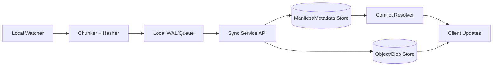

# 40. Approach Behind GitHub's File Sync

## Problem Overview
- Efficiently sync repositories/files across devices with minimal bandwidth and resilient conflict resolution.

## Functional Requirements
- Chunking + rolling hash diff algorithm (e.g., Rabin-Karp) to detect changed regions.
- Delta transfer protocol with resumable uploads/downloads and integrity checks.
- Conflict detection/resolution when devices edit concurrently; provide friendly UX for merges.
- Offline-first behavior: queue local edits, sync when network returns.

## Non-Functional Goals
- Handle repos up to multi-GB with incremental sync latency < 2s for small edits.
- Secure transfers (TLS + content-addressed storage) and zero data loss under crashes.

## Architecture Overview
- Client monitors filesystem events, chunks files, computes hashes, and stores metadata locally.
- Sync service stores per-device state (version vectors) and object store (blobs) with dedupe.
- Delta transfer uses HTTP/gRPC streaming with resume tokens; conflict resolver merges or prompts user.

## Data Design & APIs
- Chunk metadata: `(path, chunk_id, rolling_hash, strong_hash, offset, length)`.
- Version vector store per file: `(file_id, device_id, version, last_seen)` for conflict detection.
- APIs: `POST /sync/upload`, `POST /sync/delta`, `GET /sync/manifest`, `POST /sync/conflict`.

## Implementation Plan
1. Build client agent hooking into filesystem watchers and computing chunk signatures.
2. Implement local queue + WAL to survive crashes; send batched deltas to server.
3. Create server manifest service storing latest chunk signatures + version vector per device.
4. Implement download side: server compares manifests, sends missing chunks/diffs.
5. Add conflict policies (auto-merge text, rename binary, notify user) and UI flows.

## Testing & Validation
- Simulate network interruptions; ensure resume tokens continue transfer reliably.
- Test concurrent edits on slow networks; verify conflict detection, merges, and recovery.
- Benchmark chunk sizes vs. dedupe efficiency + CPU usage.

## Operational Considerations
- Monitor sync backlog, error codes, chunk dedupe ratio.
- Provide support tooling to inspect device states, kick resyncs, and purge stale chunks.

## Tutorial Deep Dive
### Block Diagram

### Design Walkthrough
- **Client responsibilities:** Watch filesystem, chunk files, compute rolling hashes, and queue deltas with resumable tokens.
- **Service fabric:** Manifest service tracks per-device version vectors; object store holds deduped blobs keyed by strong hash.
- **Conflict handling:** On divergent edits, server signals clients to merge or auto-resolves using heuristics; offline edits persist locally until sync resumes.
- **Observability:** Track backlog size, error classes, and dedupe efficiency to detect regressions early.

## Interview Kit
1. **How do you handle binary conflicts?**  
   Store both versions, rename to avoid clobbering, and prompt users to reconcile manually; include metadata in notifications.
2. **What makes sync resumable?**  
   Include chunk sequence numbers + offsets, store local WAL, and allow server to respond with “resume from chunk N” semantics.
3. **How do you secure data in transit/rest?**  
   Use TLS (mutual auth if needed), encrypt blobs at rest with per-tenant keys, and scrub temp files on clients once upload confirmed.
