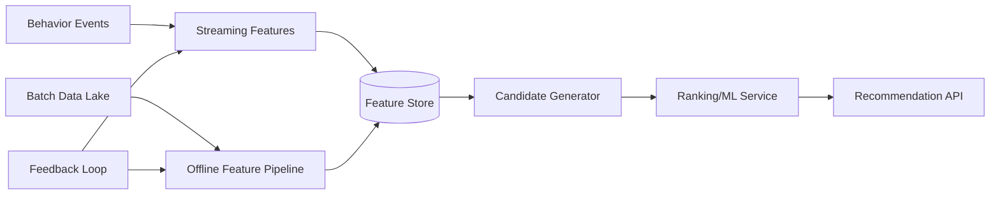

# 42. Designing & Implementing User Affinity Service

## Problem Overview
- Recommend connections, creators, or items by computing affinity scores from behavioral and graph signals with low latency APIs.

## Functional Requirements
- Define feature pipelines (offline + real-time) generating embeddings or scalar scores.
- Candidate generation + ranking service with AB testing + explainability logs.
- Feedback ingestion loops (clicks, hides) updating models.

## Non-Functional Goals
- Online scoring latency < 80 ms at p99; SLA 99.9% availability.
- Support hourly refresh for batch features, sub-second for streaming signals.

## Architecture Overview
- Offline pipeline (Spark/Beam) builds embeddings stored in vector DB; streaming jobs update incremental features (counts, recency).
- Online service: candidate generator (graph traversal, ANN search) -> re-ranker model -> response.
- Experiment platform routes traffic between model versions, collects metrics.

## Data Design & APIs
- Feature store schema: `(entity_id, feature_vector, freshness_ts, provenance)`.
- Feedback topic storing `(viewer_id, entity_id, action, weight, context)`.
- APIs: `POST /affinity/query` (inputs: viewer context, optional seeds) returning ranked list + explanations.

## Implementation Plan
1. Identify primary signals (co-engagement, follow graph, recency) and build feature definitions.
2. Stand up feature store (batch + streaming) with governance + backfills.
3. Implement candidate generation (graph hops, ANN) and ranking service w/ model hosting.
4. Integrate AB testing + explainability logging (top contributing features).
5. Close loop by ingesting feedback, retraining models, and automating deployments.

## Testing & Validation
- Offline evaluation (precision/recall, NDCG) plus online guardrail metrics (latency, CTR, fairness).
- Load test API under peak qps; profile embeddings retrieval.
- Validate explainability + audit logs meet policy requirements.

## Operational Considerations
- Monitor feature freshness, model performance drift, API latency, experiment metrics.
- Provide runbooks for feature backfill, model rollback, and bias/fairness investigations.

## Tutorial Deep Dive
### Block Diagram

### Design Walkthrough
- **Feature pipelines:** Blend offline aggregations (co-engagement, embeddings) with streaming counters for freshness; store in governed feature store.
- **Serving path:** Candidate generators fetch similarities or ANN results; ranker applies ML model with explainability hooks before returning responses.
- **Feedback:** Capture clicks/hides, feed into streaming counters and offline retraining pipelines, and monitor for drift or bias.
- **Experimentation:** Wrap API with experiment framework to compare models safely and roll back quickly if metrics drop.

## Interview Kit
1. **How do you prevent stale recommendations?**  
   Set freshness SLAs, expire embeddings beyond threshold, and rely on streaming signals to adjust scores in near-real time.
2. **What’s your approach to fairness/bias?**  
   Include fairness metrics per cohort, enforce constraints in ranking stage, and audit feature contributions for problematic correlations.
3. **How do you explain recommendations to users?**  
   Log top contributing features, store rationale with the response, and surface to UI or reviewers when needed.
